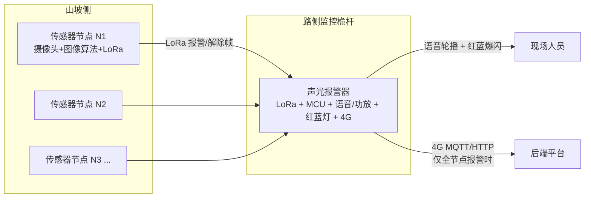
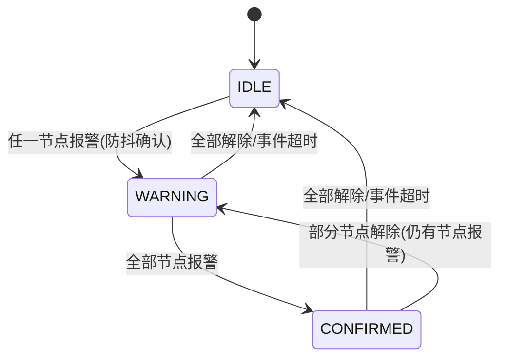

# 路侧监控桅杆声光报警器设计方案

> 项目背景：山坡沿河道按距离布设传感器节点，通过摄像头+图像算法识别泥石流；发生泥石流时节点经 LoRa 向路侧监控桅杆发送报警。桅杆侧（有 220V 市电、有网络）安装一套声光报警器：LoRa 接收 + 4G 上报 + 语音轮播 + 红蓝光警示，实现无人值守预警。

## 1. 需求要点

- 安装方式：扎带捆扎在监控桅杆上（不钻孔、可拆卸）。
- 供电：桅杆 220V 市电，内部不需电池；声音功率可做大。
- 警示：壳体两侧红蓝光警示（沿道路两个方向可见）。
- 语音：预录音频芯片，中文/英文 2 段报警人声循环切换轮播；传感器报警结束自动停播。
- 上报逻辑：
  - 全部传感器节点都报警 → 通过 4G 向后端发送"确认发生泥石流"消息；
  - 仅部分节点报警 → 只做本地声光预警，不发 4G 确认。
- 运行模式：完全无人值守，24 小时工作。

## 2. 系统架构



## 3. 工作流程与状态机



| 状态 | 条件 | 声光行为 | 4G 行为 |
| --- | --- | --- | --- |
| IDLE | 无报警 | 关闭 | 可选心跳 |
| WARNING | ≥1 个节点确认报警，非全部 | 中英文语音循环切换轮播 + 红蓝爆闪（约 1.5Hz 交替） | 不发送 |
| CONFIRMED | 全部节点确认报警 | 语音轮播 + 红蓝爆闪加快（约 4Hz），可叠加警报音 | 发送"泥石流确认"报文（失败重试 3 次，指数退避） |
| 结束 | 全部节点解除，或事件超时（如 60s 无任何 LoRa 活动） | 停止声光 | 可选发送"事件结束" |

防抖：同一节点连续收到 ≥3 条相同状态帧才生效，避免单帧误触发；窗口内收到相反状态则清零。

## 4. 硬件选型

### 4.1 主控 MCU

- 推荐：**STM32F103C8T6**（3 路 UART：LoRa / 4G / 语音；PWM×2 驱动红蓝灯；内置 RTC 与看门狗，资源富余、资料多）。
- 国产替代：GD32E230C8T6 / CH32V003（成本更低，适合批量）。

引脚资源核对（C8T6 共 37 个 GPIO）：

| 功能 | 引脚 | 数量 |
| --- | --- | --- |
| 语音 JQ8900（USART1） | PA9 / PA10 | 2 |
| LoRa DX-LR32（USART2） | PA2 / PA3 | 2 |
| 4G Air780E（USART3） | PB10 / PB11 | 2 |
| 红蓝灯 PWM（TIM2） | PA0 / PA1 | 2 |
| 语音 BUSY | PB0 | 1 |
| 功放静音 SDZ（可选） | PB1 | 1 |
| 4G PWRKEY/RESET（可选） | PB12 / PB13 | 2 |
| 测试按钮/状态灯（预留） | PB14 / PB15 | 2 |
| **合计** | | **最多 14** |

结论：余量充足，**无需升级更高规格**；若想留更多 Flash 余量（如 OTA/日志），可换同封装、引脚兼容的 **STM32F103CBT6（128KB Flash）**，板子/电路不用改。

### 4.2 LoRa 模块（接收传感器报警）

| 型号 | 频段 | 功率 | 接口 | 说明 |
| --- | --- | --- | --- | --- |
| **大夏龙雀 DX-LR32-433T22D（已有）** | 433MHz，信道可配（如 CH01=434.15MHz） | 22dBm | UART TTL 3.3V | 默认 9600 8N1；AT 指令配置信道/地址/空中速率 |

> **关键约束：报警器端与传感器节点端的 LoRa 必须配置一致——同信道（频率）、同地址（定点模式时）、同空中速率。接线：模块 TXD→MCU RX、RXD→MCU TX、共地，3.3/5V 供电看模块要求。**

配置要点（DX-LR32-433T22D，通过串口发 AT 指令，配置后重启生效）：

```text
AT+CHANNEL01   // 工作信道（01=434.15MHz），收发两端必须一致
AT+ADDR0001    // 本机地址（4 位十六进制，定点模式使用）
AT+LEVEL1      // 空中速率等级（1~N），收发两端必须一致
```

- 透传模式：两端只需信道、空中速率一致，数据直接收发。
- 定点模式：发送端需指定目标地址+目标信道，接收端地址必须与目标地址匹配；适合按节点区分收发。
- 供电 3.3V，TTL 电平与 MCU 直连；默认波特率 9600 8N1。

### 4.3 语音芯片（本次重点选型）

| 型号 | 类型 | 存储/段数 | 控制方式 | 音频更新 | 音质 | 参考价 |
| --- | --- | --- | --- | --- | --- | --- |
| **JQ8900-16P（推荐）** | MP3/WAV 解码模块 | TF 卡 / U 盘 / SPIFLASH(8M)，最多 999 段 | 串口 9600 / 一线串口 / IO | USB 直拷 `00001.mp3` 等命名文件 | 24 位 DAC、90dB 动态、85dB SNR | 8~15 元 |
| WT588F02B（备选） | 16 位 DSP 语音 IC | 内置 220KB Flash，最多 1000 段 | 一线/两线串口（部分版本 UART/SPI/IIC） | MCU 或配套下载器在线改写 | 6~32kHz WAV/MP3，PWM 直推 0.5W | 3~6 元 |
| BY8001-16P | MP3 模块 | TF / U 盘 | 串口 / IO | USB | 好 | ~10 元 |
| NV170D/NV180D | OTP 语音 IC | 10~40s，1 段 | IO 触发 | 出厂烧录，不可改 | 一般 | 1~3 元 |

**推荐结论：JQ8900-16P。**

理由：
1. 中英文 2 段人声建议用 MP3（128kbps），每条约 15~30s，总容量不足 1MB，TF 卡/8M Flash 完全无压力；WT588F02B 内置 Flash 也足够容纳，两个方案容量都满足。
2. 语音内容用 USB 拷贝进 TF 卡/Flash 即可更新，后期改词、换内容都不用改固件，现场维护方便（用读卡器或模块 USB 口）。
3. 串口指令直接支持"播放指定曲目 / 停止 / 音量 / 循环"，MCU 控制非常简单。
4. 24 位 DAC 线性输出，后级接功放音质好、底噪小。

轮播实现：MCU 按 中→英→中→英 顺序下发播放指令，每条播完（或按间隔延时）切换下一条，循环执行；收到"报警结束"即下发停止指令。

若追求最低成本并直接贴片进 PCB，选 WT588F02B；若想语音内容由模块自带按键/单独 IO 就能测试，JQ8900-16P 更省事。

### 4.4 音频功放与喇叭

- 功放：**TPA3116D2**（12/24V，2×50W Class-D，**已选 XH-M543 双声道版，DC12-26V**）或 PAM8620；大功率场景用 TPA3116D2。
- 喇叭：**8Ω 30~50W 无源铝合金金属防水号角喇叭（IP65/IP67，灵敏度 ≥106dB，如 108dB 款）**，声音可覆盖河道沿线数百米。参考规格：思璞 SIP-LS01（8Ω/25-50W/IP67/108dB/Φ210×206mm）、泰兴扬声 RAH-18A（25~50W/8Ω 可选）。
  - 购买要点：**要"定阻 8Ω"，不要"定压 100V"**（定压版内部带变压器，接功放不匹配）；铝合金壳比 ABS 塑料壳耐晒耐腐蚀，河道边首选金属款。
  - 功率匹配：功放 120W 是 24V/4Ω 的极限参数，12V 供电每声道实际只有十几瓦；喇叭选 30~50W（客服建议口径）留足余量，防音量开大/削波失真烧音圈。**必须 8Ω，不要 4Ω**。
  - 音量保护：功放板电位器固定在中间偏下，系统最大音量用语音模块串口指令限制。
- 小功率备用方案：12V 一体化语音功放模块 + 10W 防水喇叭。

### 4.5 4G 模块（仅全节点报警时上报）

| 型号 | 等级 | 协议 | 说明 |
| --- | --- | --- | --- |
| 合宙 Air780E（推荐） | Cat.1 | TCP/UDP、MQTT、HTTP(S)、TLS | AT 指令或 LuatOS；文档中文、物联卡兼容好 |
| 移远 EC200U-CN | Cat.1 bis | 同上 | 行业通用，AT 指令标准 |

- 配 SIM 卡座 + 4G 天线；使用工业物联卡。
- 上报方式建议 MQTT（长连接、断线自动重连）或 HTTP POST（简单、无需保活），具体看后端接口。

### 4.6 红蓝警示灯

- 已选型：**12V 长排红蓝爆闪警示灯，红/黑两线版**（内置爆闪控制器，通电自闪，防水）。
- 控制：MCU GPIO + **逻辑电平 N-MOS 低边开关**（**NCK4080K**：40V/80A TO-252，Vgs(th)≤2.5V，3.3V 栅压可完全导通），只控制通断，爆闪节奏由灯自带控制器执行。
  - 预警/确认：GPIO 常开让灯自闪即可（红黑两线版无外部节奏控制，MCU 翻转会与灯内节奏叠加出乱闪，不建议）；
  - 解除报警：GPIO 拉低关灯。
- 接线：12V+ → 灯条正极；灯条负极 → MOS 漏极；MOS 源极 → 12V GND；GPIO → 1kΩ → MOS 栅极，栅极对地并 10kΩ 下拉。
- 电流：灯条 1~3A，NCK4080K（80A 额定）余量充足。

### 4.7 电源设计

```
220V AC ── 保险丝+压敏电阻(MOV) ── 密封开关电源 220V→12V/5A (IP65)
                                   ├─ 12V → TPA3116D2 功放、红蓝灯条
                                   ├─ MP1584 降压 5V → Air780E 4G 模块
                                   └─ AMS1117-3.3 → MCU、语音模块、LoRa
```

- 220V 入口：保险丝 + 压敏电阻 + 放电管（防雷）；LoRa/4G 天线口加 TVS/ESD。
- 模块电源入口加 100μF/470μF 电容，防功放瞬间大电流拉低电压。
- 无需电池；可加少量储能电容防市电瞬时抖动。
- 电源推荐：桌面调试用 12V/5A 电源适配器；正式装机用 **明纬 LPV-60-12（60W）或 LPV-100-12（100W）**（IP67 防水），或国产 IP65 密封 12V/8A 开关电源。功率按总负载估算：功放 20~30W + 爆闪灯 12~36W + 其他 5W，建议 ≥60W 并留余量。
- **本方案不需要继电器**：灯条/功放用逻辑电平 MOS（NCK4080K）通断控制；继电器只适合低频开关，不适合 1.5~4Hz 爆闪翻转。

## 5. LoRa 报文格式建议

建议 ASCII 帧（便于调试，与现有 `config,` 风格一致），带 CRC：

```
ALM|<node_id>|<status>|<seq>|<timestamp>|<crc8>
ALM|N1|1|34|2026-08-18T10:00:00|A7    // 节点 N1 报警
ALM|N1|0|35|2026-08-18T10:02:00|3B    // 节点 N1 解除
```

- `node_id`：N1~Nn（n = 总节点数，通过拨码或配置命令设定）。
- `status`：1=报警，0=解除。
- `seq`：发送序号，用于去重/乱序处理。
- 也可用二进制帧 + CRC16，视传感器侧固件而定，**需与传感器侧统一**。

## 6. 4G 上报报文示例（CONFIRMED）

```json
{
  "type": "mudslide_confirmed",
  "device": "ALARM-MAST-01",
  "alarmed_nodes": ["N1", "N2", "N3"],
  "total_nodes": 3,
  "event_start": "2026-08-18T10:00:00",
  "report_time": "2026-08-18T10:00:05"
}
```

发送失败：重试 3 次（如 5s/30s/120s 退避），本地 EEPROM 留一条未上报日志待补发。

## 7. 语音内容建议（中英文循环轮播）

每条 8~15 秒，间隔 2~3 秒，播放顺序：中文 → 英文 → 中文 → 英文 循环。

| 语种 | 示例文案 |
| --- | --- |
| 中文 | "请注意！山体滑坡预警！河道危险，请立即撤离！" |
| English | "Attention! Landslide warning! Danger in the river channel. Evacuate immediately!" |

## 8. 结构与安装

- 壳体：IP65 防水盒（带 4 个挂耳），内装 PCB、电源、语音/功放；两侧开透明 PC 窗贴红蓝灯条；顶部固定防水号角喇叭。
- 安装：304 不锈钢扎带（或加厚尼龙扎带）穿过挂耳捆扎在桅杆上，不钻孔、可调节高度。
- 220V 进线：防水格兰头或航空插头，线径 ≥1.0mm²，接头做防水绝缘。
- 天线：LoRa 与 4G 天线伸出盒外固定，天线间距 ≥30cm，避免互扰。
- 建议加装"设备在线/报警中"状态 LED 与本地测试按钮（方便巡检）。

## 9. BOM 参考清单

| # | 类别 | 型号/规格 | 数量 | 参考价(元) | 备注 |
| --- | --- | --- | --- | --- | --- |
| 1 | 主控 | STM32F103C8T6 | 1 | ~8 | 或 GD32E230C8T6/CH32V003 |
| 2 | LoRa | 大夏龙雀 DX-LR32-433T22D（已有） | 0 | 0 | 3.3V UART 9600，信道/LEVEL/地址与传感器端一致 |
| 3 | 语音 | JQ8900-16P（含 8M Flash） | 1 | ~10 | 备选 WT588F02B |
| 4 | 功放 | XH-M543（TPA3116D2 双声道 2×50W，DC12-26V） | 1 | ~25 | 用单声道推 30~50W 号角，另一路备用 |
| 5 | 喇叭 | 8Ω 30~50W 无源铝合金金属防水号角（IP65/67，如 SIP-LS01 规格、RAH-18A） | 1 | 45~90 | 定阻 8Ω，接 TPA3116D2 功放输出 |
| 6 | 4G | 合宙 Air780E 模组 | 1 | ~25 | 含 SIM 卡座、天线 |
| 7 | 红蓝灯 | 12V 红蓝 LED 灯条 60cm | 2 | ~30 | 两侧安装 |
| 8 | MOS 驱动 | NCK4080K（40V/80A TO-252）×3 + 备用 | 4 | ~6 | 灯条 ×2 + 功放 ×1；3.3V 栅压可导通 |
| 9 | 电源 | 220V→12V/5A IP65 开关电源 | 1 | ~60 | 或明纬 MPM-30-12 |
| 10 | 降压 | MP1584 5V + AMS1117-3.3 | 各1 | ~5 | |
| 11 | 防雷 | 保险丝/MOV/GDT/TVS | 若干 | ~10 | 220V 与天线口 |
| 12 | 壳体 | IP65 防水盒（含挂耳） | 1 | ~30 | 扎带安装 |
| 13 | 扎带 | 304 不锈钢扎带 | 4 | ~10 | |
| 14 | 天线 | LoRa 433M + 4G 吸盘天线 | 各1 | ~25 | |
| 15 | PCB | 双面板打样+贴片 | 1 | ~80 | 批量后降低 |
| | | **合计** | | **~365~410** | 不含人工/结构开模；LoRa 模块已有 |

## 10. 待确认事项

1. DX-LR32-433T22D 的信道、空中速率等级（LEVEL）、工作模式（透传/定点）与地址——与传感器端逐项核对一致（报警器才能收到报警帧）。
2. 传感器节点总数（"全部节点报警"的判定基准，以及配置方式：拨码/AT 指令/网页）。
3. 后端上报接口：MQTT topic / HTTP URL、鉴权方式、字段格式。
4. "报警结束"信号来源：传感器主动发解除帧，还是报警器超时自动停（建议两者结合）。
5. 语音内容：中英文报警文案定稿（可参考第 7 节示例，按当地习惯调整措辞）。
6. 是否预留：设备心跳/自检上报、远程升级（OTA）、本地日志导出。

## 11. 下一步建议

1. 与传感器侧确认 LoRa 参数 → 锁定 LoRa 模块与报文协议。
2. 录制中英文 2 段报警语音 → 生成 `00001.mp3`（中文）、`00002.mp3`（英文）拷入 JQ8900-16P。
3. 画原理图/PCB（MCU + LoRa + 语音/功放 + 红蓝灯 + 4G + 电源）。
4. 写固件：LoRa 解析、防抖、状态机、语音轮播、LED 频闪、4G 上报。
5. 样机组装 → 现场挂桅杆实测（通信距离、音量覆盖、多节点联动、4G 上报）。

## 12. 器件购买清单（样机调试版）

> 样机阶段全部买现成模块，洞洞板/杜邦线搭接即可验证；定型后再画 PCB、改芯片级采购。

| # | 器件 | 规格/版本要求 | 数量 | 参考价(元) | 避坑提示 |
| --- | --- | --- | --- | --- | --- |
| 1 | MCU 开发板 | STM32F103C8T6 最小系统板 | 1 | ~10 | 或买芯片自画板 |
| 2 | LoRa 模块 | 大夏龙雀 DX-LR32-433T22D（**已有，无需购买**） | 0 | 0 | 3.3V；确认与传感器端同信道/LEVEL/地址 |
| 3 | 语音模块 | JQ8900-16P（**8M Flash 版**） | 1 | ~12 | 选带 Flash 的版本，USB 才能拷语音；串口 9600 控制 |
| 4 | 功放板 | XH-M543（TPA3116D2 双声道，DC12-26V） | 1 | ~30 | 双声道版即可，别买 2.1 低音版；12V 供电在范围内 |
| 5 | 喇叭 | 8Ω 30~50W 无源铝合金金属防水号角（IP67，灵敏度≥106dB） | 1 | 45~90 | 搜"8欧 40W 金属防水号角 定阻"；不带功放，接功放输出 |
| 6 | 4G 模组 | 合宙 Air780E + SIM 卡座 + 天线 | 1 | ~35 | 或买 Air780E 开发板（带 USB 调试） |
| 7 | 红蓝灯条 | 12V 红蓝 LED 灯条 60~100cm | 2 | ~40 | 两侧各一条，需 12V 驱动 |
| 8 | MOS 管 | NCK4080K（40V/80A TO-252）×4 | 4 | ~6 | 灯条 ×2 + 功放 ×1 + 备用；逻辑电平型 |
| 9 | 电源 | 220V→12V/5A **IP65 密封开关电源** | 1 | ~60 | 注意接线端子防水、接地 |
| 10 | 降压模块 | MP1584（5V 输出） | 1 | ~8 | 给 4G 模块供电 |
| 11 | LDO | AMS1117-3.3 | 2 | ~1 | 给 MCU/语音/LoRa 供电 |
| 12 | 防雷/保护 | 保险丝座+保险丝、压敏 14D471K、TVS | 若干 | ~10 | 220V 入口与天线口 |
| 13 | 壳体 | IP65 防水盒（带挂耳） | 1 | ~30 | 两侧开透明窗放灯条 |
| 14 | 扎带 | 304 不锈钢扎带（长 300mm+） | 4 | ~10 | 捆桅杆用 |
| 15 | 天线 | 4G 吸盘天线；LoRa 天线用套件自带（433M） | 1+0 | ~15 | 4G 天线需 SMA 接口；LoRa 天线确认套件已含 |
| 16 | 调试工具 | ST-Link/DAP 下载器；CH340 USB-TTL | 各1 | ~25 | 烧录与串口调试 |
| 17 | 辅材 | 杜邦线、接线端子、热缩管、防水格兰头 PG7/PG9 | 若干 | ~20 | 220V 进线用格兰头/航空插头 |
| 18 | SIM 卡 | Cat.1 物联网卡（支持 MQTT/HTTP 出网） | 1 | 月租另计 | 与后端平台互通确认 |
| | | **合计** | | **~360~405** | 不含 PCB 打样与人工；LoRa 模块已有 |

先别急着买的：PCB 打样、壳体开模——等功能验证通过再定。LoRa 模块已有，**装机前把报警器端与传感器端的大夏龙雀模块参数（信道/地址/空中速率）核对一致**即可。

## 13. 样机接线说明（开发板调试）

### 13.1 电源接线

```text
220V → 开关电源 12V/5A
        ├─ 12V ── TPA3116D2 功放板 DC+/DC-
        ├─ 12V ── MP1584(降压5V) ── STM32 5V 脚、JQ8900-16P VCC、Air780E 开发板 5V
        └─ GND ── 所有模块 GND 共地（功放、MCU、语音、LoRa、4G）
STM32 3.3V 输出 ── DX-LR32-433T22D VCC（3.3V）
```

- JQ8900-16P 供电 3.3V 或 5V 均可（2.8~5.5V），建议 3.3V 与 MCU 电平一致。
- 所有 GND 必须连在一起（共地），否则串口和音频都会异常。
- **STM32 最小系统板：MP1584 的 5V 接板上"5V"排针（板载稳压自动出 3.3V），严禁接"3V3"排针**，否则烧板；LoRa 的 3.3V 从 STM32 的 3V3 排针取。
- **MP1584 先空载调到 5.0V 再接线**（万用表确认），再接开发板。
- Air780E 调试期用开发板 USB 供电/串口，定型后再改 5V 供电。
- 220V 进线：三芯线接地 + 保险丝 + 空气开关/漏保（推荐），接头用防水端子。

### 13.2 语音链路（JQ8900-16P → TPA3116D2 → 号角喇叭）

```text
JQ8900-16P                    TPA3116D2 功放板
  SPK- ────────────────────→ 音频输入 L+（信号）
  GND  ────────────────────→ 音频输入 L-（输入地）
  SPK+ ────────────────────→ 悬空不用

功放板 喇叭输出 SPK+/SPK- ──→ 30~50W 无源号角喇叭两根线
功放板 DC+/DC- ────────────→ 12V 电源
```

- 模块 SPK- 作为音频信号接功放输入（该类模块的标准接法），SPK+ 悬空。
- 功放板上的音量电位器先调到最小，通电后逐步加大；模块音量用串口指令控制。
- 音频线尽量短、远离 220V 线和电源线，减少底噪。

### 13.3 串口与控制线（STM32F103C8T6 最小系统板）

| 外设 | 模块引脚 | MCU 引脚 | 说明 |
| --- | --- | --- | --- |
| 语音 JQ8900-16P | RX | PA9（USART1_TX） | MCU → 模块，波特率 9600 |
| | TX | PA10（USART1_RX） | 模块 → MCU |
| | BUSY | PB0（GPIO 输入） | 可选：检测播完自动切下一段 |
| LoRa DX-LR32-433T22D | RXD | PA2（USART2_TX） | MCU → 模块，9600 |
| | TXD | PA3（USART2_RX） | 模块 → MCU |
| 4G Air780E | TXD/RXD | PB10/PB11（USART3） | 调试期建议用 Air780E 开发板 |
| 红蓝爆闪灯 ×2 | MOS 栅极 ×2 | PA0/PA1（GPIO 通断） | 每侧一盏，控制 12V 通断 |
| 功放电源（可选） | MOS 栅极 | PB1（GPIO 通断） | 待机断电静音；报警时先开功放再播语音 |

- 串口全部交叉接：MCU TX → 模块 RX，模块 TX → MCU RX。
- 功放板的 SDZ（关断）脚可选接一个 MCU GPIO，用于静音控制，不接也能用。
- 调试顺序：先只接语音链路出声 → 再加 LoRa 收帧 → 最后接 4G 和灯条。

### 13.4 红蓝爆闪灯控制（12V 低边开关）

```text
12V+ ──── 灯条正极（红）
灯条负极（黑）── MOS 漏极 D
MOS 源极 S ──── 12V 电源 GND（与 MCU 共地）
MCU GPIO(PA0) ──1kΩ── MOS 栅极 G
                       └──10kΩ── GND（下拉防误开）
```

- MOS 用逻辑电平型：**NCK4080K（40V/80A TO-252，已选）**；不要用 IRFZ44N（3.3V 栅压推不开）。
- GPIO 高=灯亮，低=灯灭；红/黑两线版爆闪节奏由灯内控制器自动执行，MCU 只做通断（报警时常开，解除时关闭），不做高频翻转。
- 两侧各一盏，PA0/PA1 分别控制；灯条电流 1~3A，NCK4080K 余量充足。

### 13.5 功放电源控制（MOS 开关，可选）

```text
12V+ ──── 功放板 DC+
功放板 DC- ── MOS 漏极 D（NCK4080K，功放上电浪涌电流大）
MOS 源极 S ── 12V 电源 GND
MCU GPIO(PB1) ──1kΩ── MOS 栅极 G
                         └──10kΩ── GND
```

- 待机状态功放断电：无底噪、省电；报警时先开功放电源，延时 100~200ms 再发语音播放指令。
- 桌面测试阶段可先不接 MOS，功放直连 12V 验证声音；12V 电源先买普通 12V/3A 适配器即可，IP65 密封电源留到装机前。
- 线径：控制信号（GPIO→MOS 栅极）可用杜邦线；**功率回路（12V→功放 DC+/DC-、MOS 漏极/源极、功放→喇叭）必须用 0.5mm² 以上（20AWG）导线**，杜邦线细、发热压降大，只能小音量短时应急。
- MOS 为 TO-252 贴片，三脚直接焊短导线并套热缩管绝缘，避免与散热片/壳体短路。
